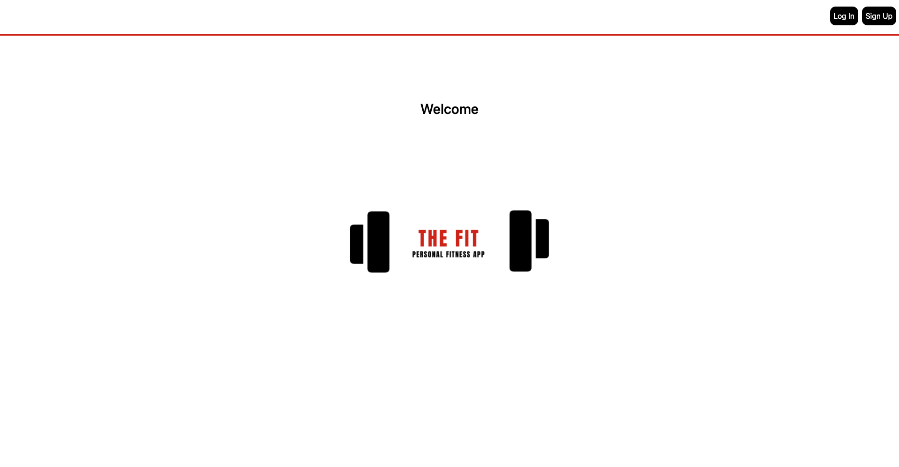
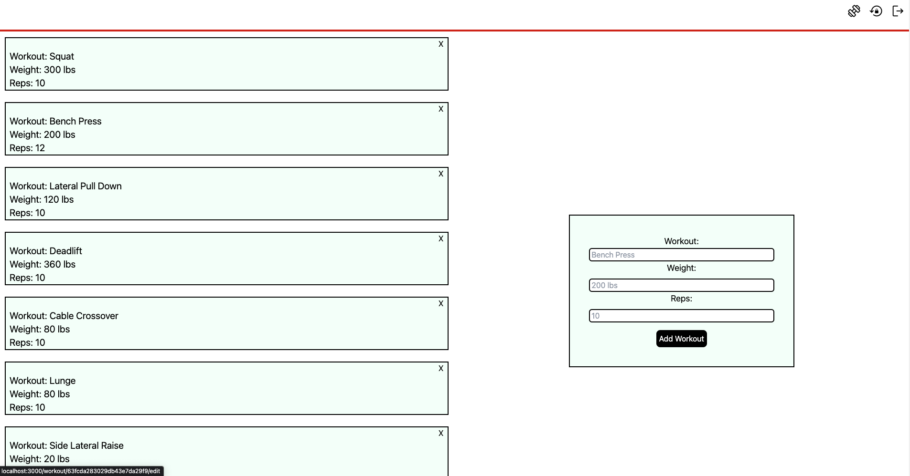

# My Personal Fitness

## Link to App- [My Personal Fitness](https://fit-for-one.netlify.app/)

## Description

My Personal Fitness is an app made for those who love to stay active. I wanted to practice making a MERN stack app with authentication and decided to create one about fitness. I didn't want the app to be too large or overly complicated, so I decided to make it simple. Anyone who wants to use this app has to sign up so that their added workouts can be tracked. A user can add the name of the workout, amount of weight being used, and the reps per set.

## Technolgies used:

* React
* MongoDB
* Mongoose
* Node.js
* TailwindCSS
* JWT
* Express
* Google Fonts
* Canva